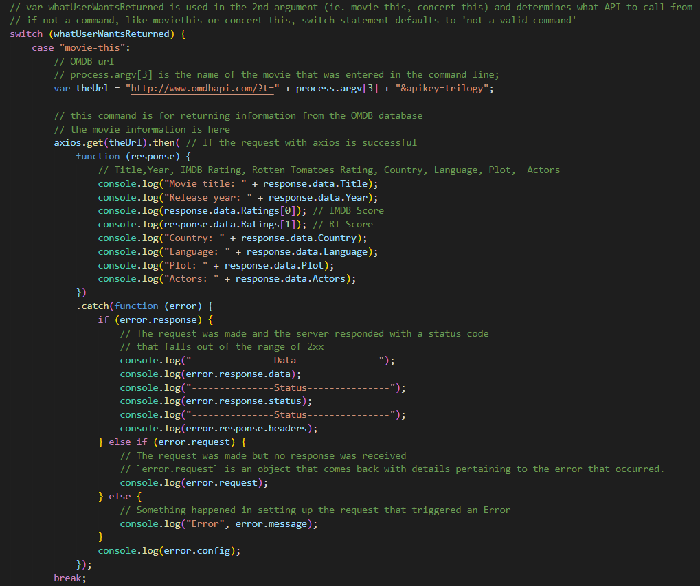

## Project title and Deployed Link
The project uses node.js to take arguments from the command line that calls
from the BandsInTown API for concert info, Spotify API for track info, and
OMDB API for movie info. This can be used to pull information about any movie,
concert, or song that is in any of those API's. 

## Motivation
To pull information from multiple API's through a simple command line. Easily
access concert information, music information, and movie information.

## Technologies Used
<b>Built with</b>
- [Node](https://nodejs.org/)
Node.js is an open-source, cross-platform, JavaScript runtime environment that executes JavaScript code outside of a browser.

- [Moment](https://momentjs.com/)
Parse, validate, manipulate, and display dates and times in JavaScript.

- [Axios](https://github.com/axios/axios)
Promise based HTTP client for the browser and node.js

- [DotENV](https://www.npmjs.com/package/dotenv)
Dotenv is a zero-dependency module that loads environment variables from a .env file into process.env.

- [NPMJS](https://www.npmjs.com/)
Essential JavaScript development tools that help you go to market faster and build powerful applications using modern open source code.

## Features
movie-this command to search omdbAPI
concert-this command to search BandsInTownAPI
spotify-this-song command to search Spotify API for song info
do-what-it-says command to search commands from a .txt file

## Code example

## How to use
1. Download files
2. Supply your API keys for Bandsintown, Spotify, and OMDB in a .env file
3. type (node i) in terminal to install all dependencies
4. run the file through node, takes 4 arguments:
    node liri.js (do-what-it says OR spotify-this-song or concert-this OR movie-this) + (song,movie,or band of your choice)

## License
MIT © [Manuel Camilo]()
